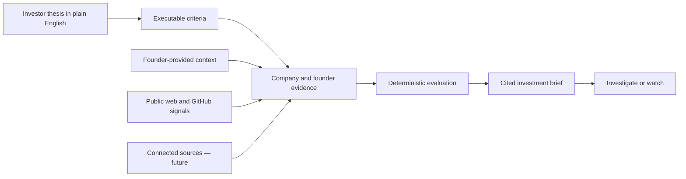

# UNDR

### Find what is under the radar.

**UNDR is a founder-first deal intelligence platform for investors moving into early-stage startups.** Describe what you want to invest in, discover companies that match, and get a concise investment brief built from public signals, founder-provided context, and clearly labeled evidence.

Built for the **Maschmeyer Group — The VC Brain** track at HackNation.

> Hackathon prototype. UNDR supports investment research; it does not provide investment advice or replace due diligence.

## The problem

The earlier a startup is, the less useful traditional company databases become.

Promising founders may have a product, early customers and strong execution, but no press coverage, funding announcement or polished public profile. Investors are left searching across pitch decks, company websites, LinkedIn, GitHub and spreadsheets, then deciding which claims they can actually trust.

This creates two failures:

- investors miss strong companies that are not already visible;
- founders with less public presence struggle to make their progress legible.

## What UNDR does

An investor can ask:

> Find early-stage B2B software companies in the US or UK, with fewer than 10 people and visible execution signals.

UNDR turns that thesis into executable criteria, evaluates a company set, and returns:

- ranked companies that match the thesis;
- founder profiles, public track record and social identity;
- product, market, execution and traction signals;
- a short, cited investment brief;
- explicit gaps, conflicts and diligence questions;
- a watchlist for companies that may become investable later.

Founders can claim their profile, add context, and eventually connect sources such as GitHub and Stripe to support selected claims without exposing private code or customer-level data.

## Why it is different

### Founder-first, not database-first

UNDR treats founder identity, background and execution as core investment context—not a small section underneath company metrics.

### Built for sparse evidence

Missing data does not silently become a bad score. UNDR separates fit from evidence coverage and shows what remains unknown.

### Evidence instead of confident prose

Every factual statement in a generated brief must cite known evidence. Unsupported or contradictory claims remain visibly unverified.

### A path for overlooked founders

A founder can improve the profile by supplying evidence or connecting sources. Visibility comes from proven progress, not an existing media footprint.

## How it works



The language model helps parse the thesis, structure claims and draft concise prose. It does **not** control trusted evidence IDs, verification states, scoring, ranking or investment recommendations.

## The 60-second product walkthrough

1. A VC describes the type of company they want.
2. UNDR translates the request into visible investment criteria.
3. A ranked shortlist appears with thesis fit and evidence coverage.
4. The VC opens a company and sees the founders, execution signals, risks and source-backed brief.
5. A founder connects GitHub and Stripe through a simulated verification flow.
6. The brief refreshes with new source signals, visibly labeled as simulated.
7. The VC saves the company to follow its evolution.

## Rely: the founder-submitted example

Rely shows the founder-submitted side of UNDR:

- launched in April 2026;
- 55 unique paying customers, stated by the founder;
- one-time payments, with no subscription MRR;
- Ignacio Estevo — Co-founder, CTO and Software Engineer;
- Franco Ferreira — Co-founder and CEO;
- both founders also build Acelera Agency;
- public founder LinkedIn and GitHub profiles;
- a private company GitHub organization declared by the founders.

The hackathon connector simulates Stripe and GitHub so the complete interaction can run without credentials. It is labeled `mode: "simulation"`, `Simulation verified`, and `canPromoteToVerified: false`.

The values `6 private repositories` and `284 commits in 90 days` are presentation fixtures—not observed facts. The 55-customer figure remains founder-stated until a real Stripe connection exists.

## Trust model

UNDR keeps provenance visible throughout the workflow:

| State | Meaning |
| --- | --- |
| `Founder stated` | Supplied directly by a founder, not independently verified |
| `Publicly supported` | Supported by a public company page, registry or profile |
| `Source verified` | Confirmed through a real connected source—future production state |
| `Simulation verified` | Generated by the prototype rather than a live provider |
| `Needs review` | Evidence is incomplete, ambiguous or conflicting |

GitHub activity can support an execution signal, but it does not prove code quality, intellectual-property ownership or investability. Stripe payment volume would not automatically be treated as accounting revenue.

## Current prototype

- **101-company canonical seed:** 50 US/UK early-software companies from the original Clay export plus 51 conservatively selected US candidates.
- **Public-web enrichment:** company pages, founder candidates, product links, pricing, changelogs and company-published social links.
- **Investment brief engine:** deterministic thesis evaluation, evidence coverage, four assessment axes, stable ranking and citation validation.
- **Founder-first profiles:** a fully reviewed public example, a founder-submitted Rely profile and a review-queue example.
- **Simulated verification:** typed GitHub and Stripe snapshots with reproducible frontend fixtures.
- **Persistence schema:** companies, founders, identities, evidence, source snapshots and enrichment runs in Supabase/Postgres.

## Architecture

```text
Public websites / Clay seed / founder context / GitHub
                           │
                           ▼
                  TypeScript data core
         normalization · enrichment · provenance
                           │
              ┌────────────┴────────────┐
              ▼                         ▼
     Deterministic scoring       OpenAI structured tasks
     and stable ranking          and cited brief drafting
              └────────────┬────────────┘
                           ▼
                VC brief and watchlist
```

### Main technologies

- TypeScript and Node.js
- OpenAI API with structured outputs
- Supabase/Postgres schema
- Public-web and GitHub enrichment
- Vitest for data and safety invariants

## Repository structure

```text
data/
  source/       Discovery cohorts and import audit
  enriched/     Public profiles and prototype fixtures
  briefs/       Reviewed thesis, rankings and cited briefs
docs/           Architecture, runbooks and frontend handoffs
packages/
  data-core/    Normalization, enrichment, scoring and brief engine
supabase/
  migrations/   Founder, company and evidence schema
undr.pen        Product design source
```

## Run locally

Requirements: Node.js 20+ and npm.

```powershell
Set-Location packages/data-core
npm install
npm test
npm run typecheck
```

Inspect the current seed:

```powershell
npm run analyze:seed -- ../../data/source/vc-engine-us-uk-early-software.csv
```

Public enrichment can run without a GitHub token. `GITHUB_TOKEN` is optional and only increases public API rate limits.

Generating new OpenAI briefs requires `OPENAI_API_KEY`. Secrets are read from the process environment and are never written to artifacts.

## Explore the repository

- [`data/briefs/`](data/briefs/) — reviewed thesis, rankings and cited investment briefs
- [`data/enriched/`](data/enriched/) — company evidence, founder profiles and verification fixtures
- [`docs/investment-brief-engine.md`](docs/investment-brief-engine.md) — scoring and generation runbook
- [`docs/data-pipeline.md`](docs/data-pipeline.md) — cohort, enrichment and provenance
- [`packages/data-core/`](packages/data-core/) — typed engine and test suite

## What comes next

- real founder account claiming and consent;
- read-only GitHub App and Stripe connections;
- pitch-deck ingestion with private evidence boundaries;
- company watchlists and evidence-change alerts;
- founder-controlled data rooms;
- fund-specific thesis templates and collaborative review.

---

**UNDR surfaces the companies worth understanding before everyone else already knows their name.**
