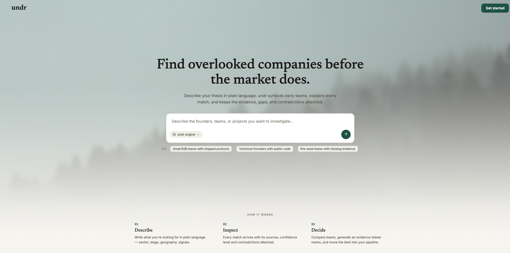
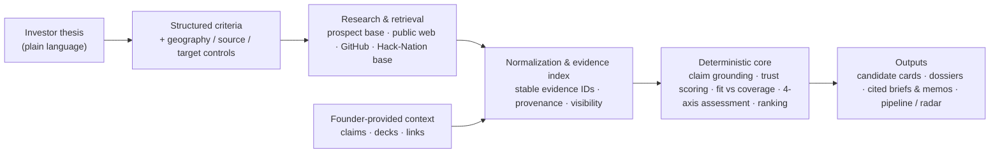

<div align="center">

# undr

### Find overlooked companies before the market does.

**A founder-first venture intelligence platform.** Describe your thesis in plain language — undr researches early-stage companies and founders across live and internal sources, keeps every claim tied to its evidence, and delivers ranked candidates, researched dossiers, and cited investment material. Fit is always shown separately from how much evidence actually backs it.

    

Built for the **Maschmeyer Group — The VC Brain** track at Hack-Nation.



</div>

> Hackathon prototype. undr supports investment research; it does not provide investment advice or replace due diligence.

**Jump to:** [3-minute tour](#the-3-minute-tour) · [What it does](#what-undr-does) · [Challenge alignment](#challenge-alignment) · [How it works](#how-it-works) · [Trust model](#trust-model) · [Security](#security--reliability) · [Run locally](#run-locally) · [Project status](#project-status)

---

## The 3-minute tour

One journey shows the whole product. Run it in demo mode (no account needed):

1. **Describe a thesis.** From the landing, *Get started* → choose the investor workspace → write your thesis in plain English ("Technical founders building developer infrastructure with a working product, before institutional seed").
2. **undr structures it.** As you type, the extractor shows the sectors, stage, geography, signals, and exclusions it understood. Saved, it becomes your standing sourcing lens.
3. **Run a search.** The workspace composer lets you pick the data source (undr engine, web search, Hack-Nation base), restrict geography (region or country — a hard filter, not a suggestion), and set how many candidates you want.
4. **Watch the agent research live.** It narrates each angle, and every real person it confirms lands as a card with role, company, fit score, confidence level, evidence links, and what remains unknown. People it cannot ground in a source never become cards — that is enforced server-side, not just prompted.
5. **Inspect a person.** Open a card for a freshly researched dossier: background, execution signals, contradictions, an evidence section restricted to URLs actually seen during research, and contact channels.
6. **Go deeper on a company.** The diligence view separates claims by state, shows the trust breakdown per claim, surfaces contradictions, and builds a cited investment memo where every factual sentence is qualified by its evidence.
7. **Decide.** Save the search, pin people to your Radar, move companies through the pipeline (discovered → reviewing → contacted → diligence → advancing / passed), or compare up to three side by side.

## The problem

The earlier a company is, the less traditional databases know about it. A team can have a working product, first customers, and real execution — and still have no funding announcement, no press, and no polished profile. Databases built on those signals go quiet exactly when sourcing matters most. Investors fall back to scattered searching across websites, LinkedIn, GitHub, and decks, then have to decide which claims to trust.

Two failures follow: investors miss strong companies that are not yet visible, and founders without a media footprint struggle to make real progress legible.

## What undr does

- **Thesis-driven search.** Your investment thesis — not keyword filters — drives ranking, and travels as context with every search you run.
- **Early-stage discovery.** A conversational research agent works across undr's prospect base, the live web, GitHub, and the Hack-Nation founder base, reporting real people with evidence attached.
- **Founder-first analysis.** People are the primary unit: researched dossiers, founder scores, identity and track-record signals — not a footnote under company metrics.
- **Fit separated from evidence coverage.** A company can score high on thesis fit while undr plainly shows how little is actually known about it. Missing data never silently becomes a bad score.
- **Provenance on everything.** Claims link to evidence records with source type, verification state, and visibility. Contradictions and unknowns stay visible instead of being smoothed over.
- **Cited investment material.** Investment briefs and memos cite evidence IDs; citation validation rejects prose that cites unknown evidence or asserts numbers no source supports.
- **Pipeline, Radar, and saved searches.** Saved explorations reopen with their full conversation and cards; pinned people stay on your Radar with the brief that surfaced them.
- **Claimable founder profiles.** Founders create and edit their own projects, upload decks privately, and publish once a completeness checklist passes. Founder-written text is labeled as founder-provided — never as verified.

## Why it is different

- **Founder-first, not database-first.** Built to evaluate people and execution when company-level data is thin.
- **Designed for sparse evidence.** `thesisFit` and `evidenceCoverage` are computed and displayed as separate numbers; "we don't know yet" is a first-class state (`needs_evidence`), distinct from "bad fit".
- **Evidence before prose.** Generated briefs must cite known evidence IDs; a validator rejects facts without citations, citations of unknown evidence, and unsupported numeric values.
- **Deterministic scoring.** Evaluation, trust scoring, four-axis assessment, ranking, and recommendations are pure TypeScript functions — reproducible, testable, and independent of any model.
- **AI kept in its lane.** Models parse language, propose claim candidates, research, and draft prose. They do not assign trust scores, control evidence IDs, set verification states, or make recommendations — those values are recomputed deterministically after every model call.
- **Trust states, not vibes.** A founder assertion stays `founder_asserted`. Public GitHub activity is evidence of a public account, not proof of code quality or IP ownership. Conflicting evidence marks a claim `conflicted` and blocks recommendation.

## Challenge alignment

The track asks for a platform judges can use to source, screen, and decide (per the design spec in [`docs/superpowers/specs/2026-07-18-hacknation-vc-track-design.md`](docs/superpowers/specs/2026-07-18-hacknation-vc-track-design.md)):

| Track need | undr implementation |
| --- | --- |
| Discover early companies from sparse inputs | Live research agent over prospect base, public web, GitHub, and Hack-Nation base; 101-company audited seed |
| Apply your own thesis instead of a generic ranking | Thesis captured in plain language, structured into weighted criteria, applied to every search and evaluation |
| Inspect public evidence in depth | Evidence records with source, verification state, and links; diligence view with per-claim trust breakdown |
| Receive a concise, explainable brief | Deterministic evaluation + cited brief; prose that restates scores or invents citations is rejected |
| Follow prospects before investing | Pipeline stages, Radar for people, saved searches that restore their full research thread |
| Inspect founders in more depth | Researched dossiers per person, founder profiles, founder scores |
| Request missing proof | Founder invitation flow; founders complete profiles with evidence and private deck uploads |
| Be distinguishable from a search database or generic chat | Fit vs. coverage separation, visible contradictions, deterministic core, grounded cards enforced server-side |

## How it works



Two engines share this shape:

- **The live workspace** (`apps/web`): a streaming research agent (Claude, AI SDK) with per-mode tools. Candidate cards are validated server-side — duplicate people are rejected, targets are enforced, and in Hack-Nation mode anyone not present in the base is bounced regardless of what the model says.
- **The brief engine** (`packages/data-core`): a CLI pipeline that canonicalizes a thesis, grounds claim candidates in evidence, scores trust, evaluates and ranks companies, and drafts cited briefs — with the model limited to structuring and prose.

## Trust model

States below are the literal values used in code (`packages/data-core/src/briefs/types.ts`, `packages/data-core/src/founder-profile-contract.ts`, `apps/web/lib/domain/types.ts`).

**Evidence** carries `verificationState`: `unverified` · `candidate_only` · `verified` · `conflicted` · `stale`, plus `visibility` (`public` · `founder_private` · `investor_private`). Published artifacts may only cite public evidence — a private citation throws instead of leaking.

**Claims** resolve to `supported` (trust score ≥ 70 across source reliability, directness, corroboration, and recency) · `unverified` · `conflicted`. The workspace additionally distinguishes `partially_supported` and `contradicted`.

**Founder profile facts** are labeled `founder_asserted` · `publicly_supported` · `integration_verified` · `unverified`.

What this guarantees in practice:

- A founder's statement is never auto-promoted to verified — it stays `founder_asserted` until public or connected evidence supports it.
- GitHub signals become evidence of a public account and activity; the GitHub enrichment endpoint returns an explicit interpretation boundary noting it proves neither code quality nor IP ownership.
- Absent data yields `needs_evidence`, not a low score: coverage drops, fit is not fabricated.
- Conflicts block recommendation (`pass_for_thesis` on a blocking conflict) and remain visible in the UI.

## Security & reliability

All of the following exist in code today (`apps/web/lib/ai/agent-guardrails.ts` unless noted):

- **Rate limiting** — per-IP sliding windows: chat 10/10 min, profile 15/10 min, search run 20/10 min, GitHub enrichment 30/10 min.
- **Concurrency cap** — max 3 concurrent agent streams, with a TTL that force-frees stuck slots.
- **Hard timeouts** — every agent run is aborted at 4 minutes (`AbortSignal.any` with the request signal); routes cap `maxDuration` at 300 s. Tool budgets bound web searches, page reads, and total steps per run.
- **Input sanitization** — only user/assistant roles pass through; text parts clamped to 4,000 chars, 60 parts per message, 40-message history; malformed parts dropped.
- **Prompt-injection posture** — a security prompt on every agent run treats all retrieved content (web pages, GitHub descriptions, catalog rows) as data, never instructions; flags injected directives; forbids revealing system instructions or the investor's thesis; forbids outputting secrets even when a page exposes them.
- **Grounding enforced server-side** — `report_candidate` rejects duplicates, over-target reports, and (in Hack-Nation mode) people not present in the base.
- **Cross-provider fallback** — failed Anthropic calls transparently retry on OpenAI (`gpt-5.6-luna`), with provider-specific tools stripped for the fallback request.
- **Citation validation** — the brief engine rejects facts without citations, unknown evidence IDs, and numeric values no evidence supports; public artifacts cannot cite private evidence.
- **Production auth** — with Supabase enabled, every quota-spending route requires a signed-in user (401 otherwise); ~90 RLS policies govern data access; the Data API is locked down to server-mediated access; privileged Supabase keys are rejected on the client by prefix/role inspection; founder decks live in a private storage bucket.

Guardrail state is in-memory (single node) — a deliberate prototype trade-off, noted in code for a Redis-backed production version.

## Architecture

```text
apps/web/                Next.js 16 app — the entire product UI + API routes
  app/                   Landing, onboarding, investor workspace, founder flow,
                         /api/agent/chat · /api/agent/profile · /api/search/run · /api/enrichment/github
  lib/                   ai (models, guardrails, harness) · domain (trust, thesis, scoring)
                         search · catalog · connectors (Tavily, GitHub, arXiv) · supabase · founder
packages/data-core/      Deterministic data & brief engine (@hacknation/data-core)
  src/briefs/            thesis canonicalization · evidence index · claim grounding ·
                         trust scoring · evaluation · 4-axis assessment · ranking ·
                         citation validation · public-artifact redaction
  src/enrichment, web/   Public-web + GitHub enrichment (robots-aware crawler)
  scripts/               Seed analysis, enrichment, and brief-generation CLIs
packages/server-api/     Framework-neutral REST handlers (@hacknation/server-api):
                         POST /v1/search · GET /v1/companies/:id/brief · PUT /v1/watchlist/:id,
                         Supabase auth + repository, production factory
data/                    source/ (Clay export + audited 101-company seed) ·
                         enriched/ (public web profiles) · briefs/ (cited brief artifacts)
supabase/migrations/     11 migrations: discovery core, product platform (RLS),
                         founder deck storage, server-api state, Hack-Nation research
docs/                    Data pipeline, brief engine, server API, Supabase runbooks + design specs
undr.pen                 Product design source (Pencil)
```

## Technologies

| Technology | Version | Role |
| --- | --- | --- |
| Next.js / React | 16.2.10 / 19.2.7 | App Router UI, server actions, API routes |
| TypeScript | 5.9 | Everything, strict |
| AI SDK (`ai`, `@ai-sdk/*`) | 7.0.31 | Streaming agents, tool calls, provider abstraction |
| Anthropic Claude | Sonnet (research) · Haiku (fast) | Sourcing agent, dossiers, structured extraction |
| OpenAI | gpt-5.6-luna / gpt-5.6-sol | Cross-provider fallback; brief-engine structuring & prose |
| Tavily | — | Optional deep web search + page extraction |
| Supabase (Postgres) | supabase-js 2.110.7 | Auth, RLS-governed persistence, private deck storage |
| Zod | 3.25.76 | Schema validation at every model and API boundary |
| Vitest | 3–4 | 70 test files across the three packages |

## Run locally

Requires **Node.js ≥ 22** and npm (npm workspaces monorepo).

```bash
git clone <repo-url> && cd hacknation-vc-track
npm install

# Configure the web app (demo mode works with just an Anthropic key)
cp .env.example apps/web/.env.local
# then edit apps/web/.env.local — see the table below

npm run dev        # → http://localhost:3000
```

Other commands (from the repo root):

```bash
npm run build      # production build of the web app
npm test           # vitest across all workspaces
npm run typecheck  # tsc across all workspaces
npm run lint       # eslint on apps/web
npm run check      # lint + typecheck + test + build
```

Brief-engine CLIs live in `packages/data-core` (`npm run analyze:seed`, `enrich:seed`, `briefs:build` — the last one requires `OPENAI_API_KEY`).

## Demo mode

`NEXT_PUBLIC_DEMO_MODE=true` is the default. Demo mode means **no Supabase and no accounts**: the investor workspace persists in the browser (thesis, pipeline, radar, saved searches with their full conversation transcripts), and the diligence, evidence, and memo views run on a deterministic synthetic catalog of demo opportunities.

What still needs keys in demo mode:

- **The live sourcing agent needs `ANTHROPIC_API_KEY`** (and uses Anthropic-native web search). Without any model key the chat routes return 503; everything else stays navigable.
- `TAVILY_API_KEY` (optional) upgrades research with deep search and page reading.
- `GITHUB_TOKEN` (optional) raises GitHub API rate limits.

Setting `NEXT_PUBLIC_DEMO_MODE=false` with Supabase credentials enables real accounts, the founder flow (profile creation, AI structuring, deck upload, publishing), and database-backed theses, pipelines, saved searches, and memos.

## Environment variables

| Variable | Required | Scope | Used for |
| --- | --- | --- | --- |
| `NEXT_PUBLIC_DEMO_MODE` | optional (default `true`) | browser | Demo-first switch; `false` enables Supabase accounts |
| `NEXT_PUBLIC_SUPABASE_URL` | with Supabase | browser | Supabase project URL |
| `NEXT_PUBLIC_SUPABASE_PUBLISHABLE_KEY` | with Supabase | browser | Public key only — privileged keys are detected and rejected |
| `ANTHROPIC_API_KEY` | for the live agent | server | Claude models + native web search |
| `OPENAI_API_KEY` | optional | server | Cross-provider fallback; brief engine; founder AI structuring |
| `TAVILY_API_KEY` | optional | server | Deep search + page extraction during research |
| `GITHUB_TOKEN` | optional | server | Higher GitHub API rate limits |
| `SUPABASE_SECRET_KEY` | production only | server | Server-side Supabase operations |
| `OPENAI_EXTRACTION_MODEL` / `OPENAI_BRIEF_MODEL` | optional | server | Brief-engine model overrides |

Secrets belong in `apps/web/.env.local` (git-ignored). Never commit keys.

## Code quality

- `npm run check` chains lint, typecheck, tests, and build.
- **70 Vitest test files** (~450 tests): 36 in `data-core`, 31 in `apps/web`, 3 in `server-api`.
- Coverage includes the parts that make the product trustworthy: deterministic scoring and ranking, claim grounding, citation validation (including numeric support), trust calculation, public-artifact privacy (private evidence cannot leak into published briefs), agent guardrails (rate limits, stream slots, sanitization), search-session privacy (the brief never leaks into onboarding URLs), and CLI filesystem safety.
- Lint, typecheck, and production build pass; two tests are environment-sensitive (one calls a live LLM, one covers a brief-engine CLI area under active development).

## Data & limitations

- **Seed**: a 50-company Clay export (US/UK early software) extended to an audited 101-company canonical seed — 51 conservative US candidates accepted, 49 rejected, with the audit trail committed (`data/source/us-early-stage-startups-2026-07-18-audit.json`).
- **Enrichment**: public-web profiles (robots-aware crawler; HTML only, 2 MB / 8 s caps) and GitHub signals for the original 50; the 51 newer seed companies are not yet enriched.
- **Brief artifacts**: `data/briefs/` holds 50 deterministic evaluations and cited briefs for a reviewed thesis, with private evidence redacted.
- **Synthetic fixtures**: the demo diligence/memo/evidence opportunities and demo founder profiles are clearly-labeled synthetic data, not real companies.
- **Prototype connectors**: Tavily, GitHub, and arXiv connectors are working prototypes; Stripe-style "connected source" verification (`integration_verified`) is a designed state, not yet backed by a live integration.
- **Dossier citations** are grounding-prompt-enforced (URLs must come from tool results); programmatic citation validation currently applies to the brief engine, not the live dossier stream.
- undr accelerates research. It does not replace due diligence, and says so in the product.

## Project status

**Working now (demo mode + model key):** thesis onboarding, live sourcing agent with per-source modes and geography filtering, candidate cards with server-enforced grounding, person dossiers, radar/pipeline/saved searches with full-conversation restore, diligence + cited memo views on the synthetic catalog, deterministic brief engine with citation validation (CLI).

**Working with Supabase configured:** accounts and magic-link auth, founder onboarding with AI structuring and private deck upload, claimable/publishable founder profiles, database-backed theses, pipelines, saved searches, and memo generation with citation-integrity rules under RLS.

**Roadmap (designed, not built):** live connected-source verification (e.g. Stripe), Redis-backed guardrail state for multi-node deployment, enrichment of the extended seed cohort, alerting on saved searches.

---

**undr surfaces the companies worth understanding before everyone else knows their name — and shows you exactly how much of that understanding is backed by evidence.**
